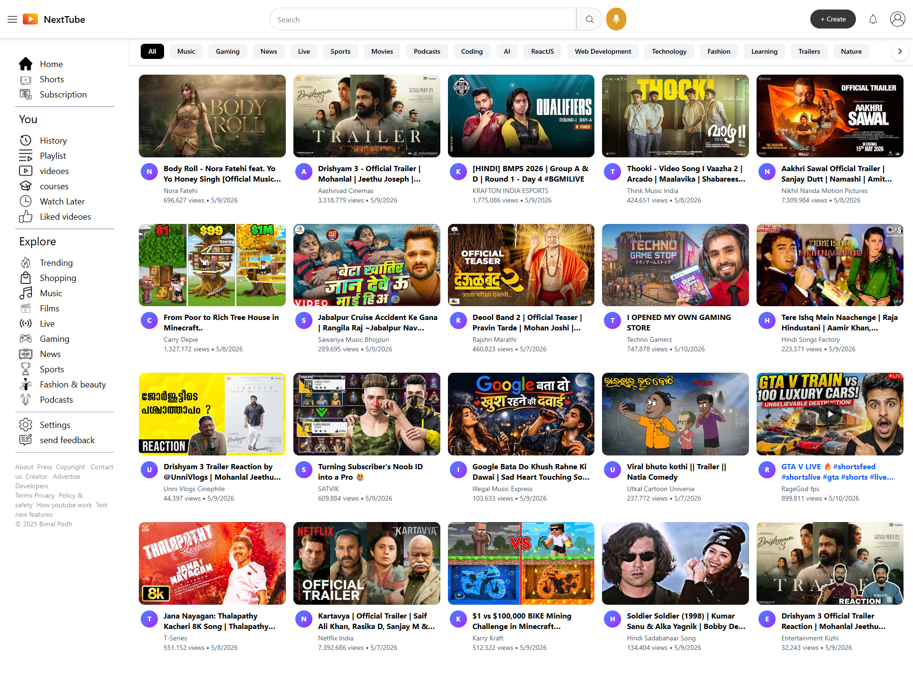

# 🎬 NextTube - Premium Video Streaming Platform



NextTube is a high-performance, feature-rich YouTube clone built with the latest modern web technologies. It features dynamic category filtering, a real-time live chat simulation, intelligent suggested videos, and a pixel-perfect responsive design.

---

## ✨ Key Features

- **🚀 Dynamic Category Filtering:** Seamless horizontal scrollable category list (All, Music, Gaming, Coding, etc.) with instant API-driven results.
- **📱 Responsive Design:** Fully optimized for Mobile, Tablet, and Desktop with a smooth, collapsible sidebar.
- **🎥 Professional Watch Page:** Advanced video player integration with contextual metadata and suggested videos sidebar.
- **💬 Real-time Live Chat:** Simulated live chat engine using Redux Toolkit with automatic message rotation and performance-optimized rendering.
- **🔍 Intelligent Search:** Debounced search suggestions and a dedicated results page for accurate content discovery.
- **✨ Premium UI/UX:**
  - Modern YouTube-inspired aesthetic.
  - Custom Shimmer/Skeleton loading states.
  - Smooth transitions and hover effects.
  - Lucide React icons for high-fidelity visuals.
- **⚡ Performance Optimized:**
  - Code splitting and manual chunking.
  - Lazy loading for all major pages.
  - Memoized components to prevent unnecessary re-renders.

---

## 🛠️ Tech Stack

- **Core:** React 19 + Vite
- **State Management:** Redux Toolkit
- **Styling:** Tailwind CSS v4
- **Routing:** React Router v7
- **Icons:** Lucide React
- **API:** YouTube Data API v3

---

## 🚀 Getting Started

### 1. Clone the repository
```bash
git clone https://github.com/Bimalpodh/nextTube
cd nextTube
```

### 2. Install dependencies
```bash
npm install
```

### 3. Setup Environment Variables
Create a `.env` file in the root directory and add your YouTube Data API v3 key:
```env
VITE_GOOGLE_API_KEY=YOUR_YOUTUBE_API_KEY_HERE
```

### 4. Run the development server
```bash
npm run dev
```

---

## 📦 Deployment

This project is optimized for deployment on **Vercel**. 

- **SPA Support:** `vercel.json` is pre-configured to handle React Router client-side routing.
- **Asset Caching:** Implemented aggressive caching for static assets in the Vercel CDN.
- **Build Configuration:** Automatic Vite build detection with optimized Rollup chunking.

To deploy, simply connect your repository to Vercel and ensure you add the `VITE_GOOGLE_API_KEY` in the environment variables section.

---


---

**Built with ❤️ by [Bimal Podh](https://github.com/Bimalpodh)**
